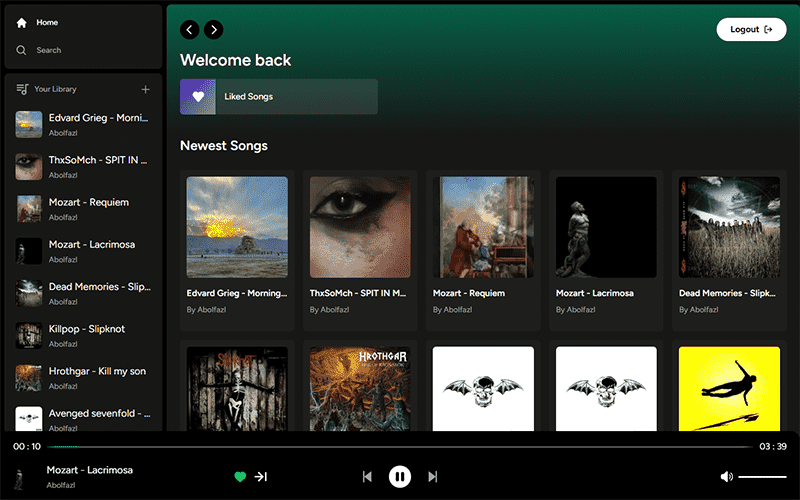
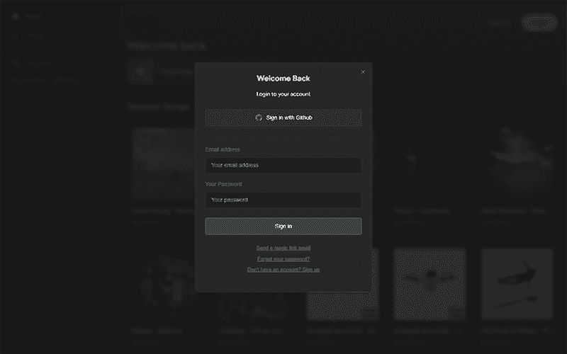
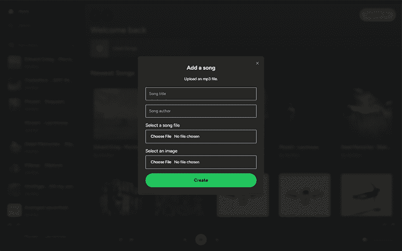
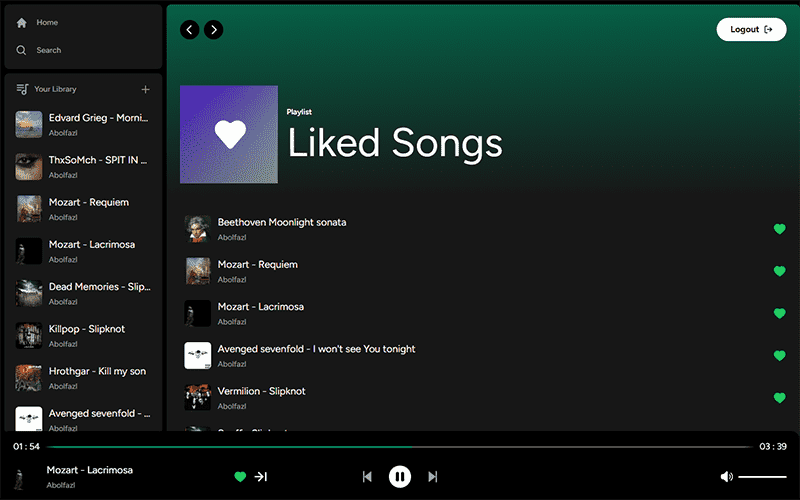
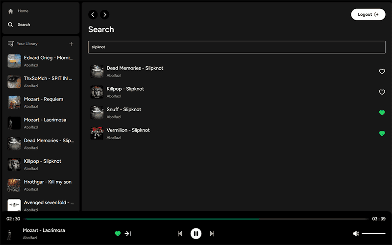

# 🎵 MelodiMix (spotify clone)

### MelodiMix, a music web application where users can listen to songs uploaded by others and also upload their own tracks. With its stunning user interface, MelodiMix allows us to like songs, curating a personalized collection accessible on the Liked page. This application features an advanced music player system, providing access to comprehensive song information and offering various additional functionalities. Moreover, it includes a powerful search system where users can easily find songs by typing their titles. MelodiMix revolutionizes the way we discover and enjoy music. (اگه ایران هستید از فیلترشکن استفاده کنید)

## Link 🔗 [https://melodi-mix.vercel.app](https://melodi-mix.vercel.app)

 

# Preview

 

# Mobile Responsive

# Technologies

 

<ul>
    <li>
        
    </li>
    <li>
        
    </li>
    <li>
        
    </li>
    <li>
        
    </li>
    <li>
        
    </li>
    <li>
        
    </li>
    <li>
        
    </li>
</ul>
